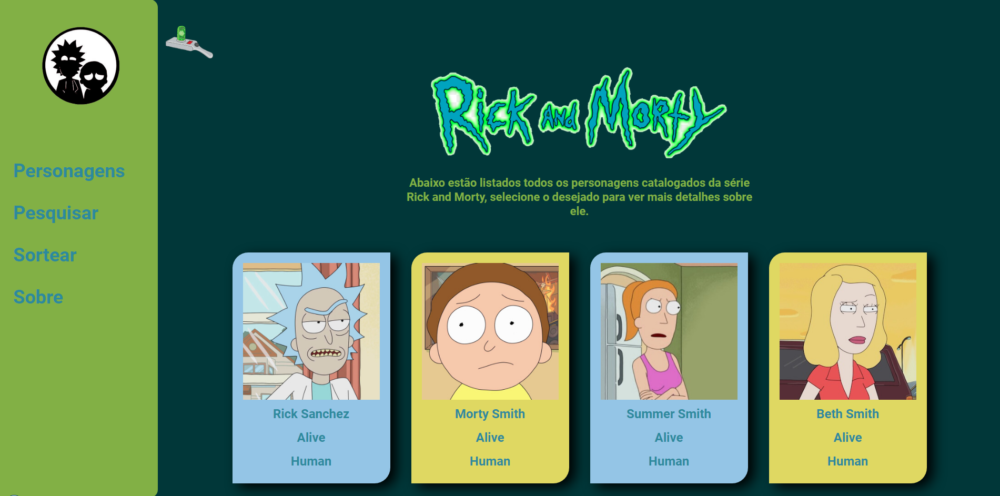

<h1 align="center"> Rick and Morty </h1>

    

Projeto desenvolvido utilizando The Rick and Morty API dos desenvolvedores [Axel Fuhrmann](https://axelfuhrmann.com/) e [Talita](https://talitatraveler.com/) que retorna dados da serie como personagens, lugares, episodios etc.

## Descrição

Rick and Morty é uma série de animação adulta norte-americana de comédia e ficção científica criada por Justin Roiland e Dan Harmon,
Utilizando o figma foi criado o layout do projeto besando-se em elementos evidentes da serie, A ideia e passa referencia encontradas no desenho para o projeto por exemplo o botão menu que esta sendo representado pela arma de portais de um dos personagens principais e alem de outras referencia ao mundo ficticio da animação.

## Status do Projeto

**Em Andamento**: O projeto não esta terminado ainda, havera futuras alterações de funcionalidade e responsividade que acontecera em breve.

## Construído com

* [HTML](https://www.w3schools.com/html/) - HTML abreviação para a expressão inglesa HyperText Markup Language, que significa: "Linguagem de Marcação de Hipertexto" é uma linguagem de marcação utilizada na construção de páginas na Web. Documentos HTML podem ser interpretados por navegadores. A tecnologia é fruto da junção entre os padrões HyTime e SGML.

* [CSS](https://www.w3schools.com/css/default.asp) - Cascading Style Sheets é um mecanismo para adicionar estilo a um documento web. O código CSS pode ser aplicado diretamente nas tags ou ficar contido dentro das tags "style". Também é possível, em vez de colocar a formatação dentro do documento, criar um link para um arquivo CSS que contém os estilos.

* [JavaScript](https://developer.mozilla.org/pt-BR/docs/Web/JavaScript) - CJavaScript é uma linguagem de programação interpretada estruturada, de script em alto nível com tipagem dinâmica fraca e multiparadigma. Juntamente com HTML e CSS, o JavaScript é uma das três principais tecnologias da World Wide Web.

* [API](https://www.w3schools.com/js/js_api_intro.asp) - Interface de Programação de Aplicações (português europeu) ou Interface de Programação de Aplicação (português brasileiro), cuja sigla API provém do Inglês Application Programming Interface, é um conjunto de rotinas e padrões estabelecidos por um software para a utilização das suas funcionalidades por aplicativos que não pretendem envolver-se em detalhes da implementação do software.

## Autor

* **Cesar dos Santos de Almeida** - *responsável pela construção e desenvolvimento do projeto*

## Licença
Este projeto está licenciado sob a licença MIT - consulte o arquivo  [LICENSE.md](LICENSE.md) para obter detalhes

## Agradecimentos

* [The Rick and Morty API](https://rickandmortyapi.com/) - A API Rick and Morty é uma API REST (ish) e GraphQL baseada no programa de televisão Rick and Morty.

## Links

* [Layout do Projeto](https://www.figma.com/file/ytZm9eqrx6VIrkWGnfc2j5/API-de-Rick-e-Morty?node-id=58%3A38) - Link do projeto no figma

